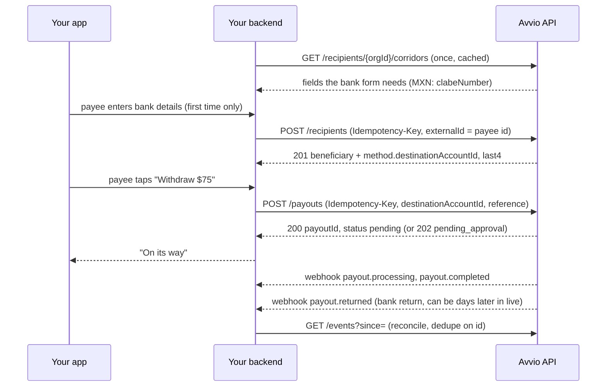

# Avvio Payouts Integration Guide

From a new business account to a live payout sent from your own app. One
developer, or one coding agent given this file, can follow it top to bottom.
Steps 1 to 3 happen in the dashboard (about 20 minutes); step 4 onward is the
integration itself, and the agent runbook at the end covers the same ground
over the API.

The reference for each topic is at [docs.avvio.xyz](https://docs.avvio.xyz),
and everything is in one file for agents at
[avvio-docs.pages.dev/llms-full.txt](https://avvio-docs.pages.dev/llms-full.txt).
The OpenAPI contract is `partner-payouts.openapi.yaml` in the API reference.
The reference app in this repository implements every step below; the
[README](README.md) maps each step to the file that does it.

## Who this is for

- **You, the partner:** the business that holds the Avvio account and the
  funded USD balance. Every payout debits this balance. The API key belongs on
  your backend and never leaves it.
- **Payee (the API calls it a beneficiary):** the person you pay. Their bank
  details are entered once, in your app, and they are paid into that account
  from then on. They never onboard with Avvio.
- **End user, optional:** your own customer on whose behalf you pay, when that
  is how your product works (an employer in payroll, a merchant in a
  marketplace). See `endUser` in step 4d.

You build the whole payee experience yourself. Your app collects the bank
details, your backend registers the payee as a beneficiary once, and every
payout after that is one call: `POST /payouts` with the payee's
`destinationAccountId`. Avvio is never in front of your payee.

What you will have at the end: a sandbox organization, a test API key, a
webhook endpoint that verifies signatures, two payees registered from a form
your app rendered from the corridor definition, one payout completed and then
returned by the bank, one payee paid twice in one tap, and a reconciliation
loop reading the events feed.

One base URL for both environments:
`https://api.avvio.xyz/business/api/v1`. The key prefix picks the environment:
`avvio_test_` is sandbox, `avvio_live_` is production. Every path carries your
organization id, and it is the same id in both environments.

## How the pieces fit



Your backend is the only party that talks to Avvio. Bank details travel from
the payee's device to your backend to Avvio once, at registration; after that
your backend holds a `destinationAccountId` and a `last4`, never the account
number. The API key never reaches the app.

## Step 1: Account and dashboard setup (about 10 minutes)

1. Go to [business.avvio.xyz](https://business.avvio.xyz) and sign in with
   your work email; you receive a one-time code. Name your business and choose
   **Create Business Account**. That creates your organization: it holds the
   balance, the keys, the webhooks and the team. Add a passkey when offered.
2. Open **Developer** in the sidebar. The page header shows your
   **Organization ID** with a copy button (a cuid such as
   `cmsx0h2k900a1n11ib3qz9v42`). Save it as `AVVIO_ORG_ID`.
3. Invite your developers: organization menu → **Members** → their email and
   a role. Anyone with access to the Developer page can create **sandbox**
   keys; **live** keys are issued by an owner, admin or operator.
4. Start business verification (KYB) now, in parallel: open **Verify** and
   complete it once (the legal entity, its beneficial owners and one control
   person). Nothing in this guide waits for it until step 6.

| Status | What it means |
|---|---|
| Draft | Not sent yet. Finish and submit it |
| Under review | With us. We email you when it is done |
| Needs information | We asked for something. The dashboard shows what, and a button to answer |
| Approved | Live keys may be used and live payouts settle |
| Rejected | Contact support |

## Step 2: Sandbox and credentials (about 5 minutes)

1. On the **Developer** page, choose **Create API key**. A key created for the
   sandbox starts with `avvio_test_`; owners and admins can also switch the
   whole dashboard to the sandbox from the organization menu (**Switch to
   Sandbox**), where the same page creates test keys.
2. Copy the key when it is shown; it is shown once. Store it as
   `AVVIO_API_KEY` in server-side secret storage. If you lose it, revoke it and
   create another.

| Field | Value for this guide |
|---|---|
| Key name | `my-app-sandbox` |
| Permission | **Transact** (read-only cannot register beneficiaries or send) |
| Consents | Leave both unticked. Bank payouts need neither |
| Expires after | 1 year (default) |
| Allowed IP addresses | Optional. Exact egress IPs, comma separated |

```bash
export AVVIO_BASE_URL=https://api.avvio.xyz/business/api/v1
export AVVIO_ORG_ID=cmsx0h2k900a1n11ib3qz9v42
export AVVIO_API_KEY=avvio_test_…
```

Send the key as `x-api-key` on every call, from your backend only. **Rotate**
creates a successor and keeps the old key valid for 24 hours; **Revoke** stops
it immediately.

**Fund the sandbox.** Its balance starts at zero and every payout here debits
it. In the sandbox view of the dashboard press **Add $10,000**, or call:

```bash
curl -s -X POST "$AVVIO_BASE_URL/payments/organizations/$AVVIO_ORG_ID/sandbox/fund" \
  -H "x-api-key: $AVVIO_API_KEY" \
  -H "Idempotency-Key: $(uuidgen)" \
  -H "content-type: application/json" \
  -d '{"amount":"10000.00"}'
```

## Step 3: Webhook endpoint (about 5 minutes)

You need a publicly reachable HTTPS URL; a tunnel to your laptop is fine for
the sandbox.

1. On the **Developer** page, **Webhooks** tab, choose **Add endpoint**.
2. Enter the URL and tick the six `payout.*` events: `payout.pending`,
   `payout.processing`, `payout.completed`, `payout.failed`,
   `payout.returned`, `payout.canceled`. If your organization uses payout
   approvals, add the `payout_approval.*` events too.
3. The signing secret is shown once. Store it as `AVVIO_WEBHOOK_SECRET`; it
   starts with `whsec_`.

A sandbox endpoint can also be registered with a test key:

```http
POST /payments/organizations/{orgId}/sandbox/webhook-endpoints
x-api-key: avvio_test_…
Content-Type: application/json

{ "url": "https://hooks.example.com/avvio",
  "events": ["payout.pending", "payout.processing", "payout.completed",
             "payout.failed", "payout.returned", "payout.canceled"] }
```

The answer carries `id` and `secret` (shown once). Live endpoints are added in
the dashboard only; an API key cannot register, repoint or delete one.

Every delivery is signed with [Standard Webhooks](https://www.standardwebhooks.com/),
so any Svix-compatible verifier works. Verify before you parse:

1. Read `svix-id`, `svix-timestamp` and `svix-signature`.
2. Reject the delivery if `svix-timestamp` is more than 5 minutes from now.
3. Build the signed content `${svix-id}.${svix-timestamp}.${raw body bytes}`.
4. Base64-decode the secret after its `whsec_` prefix, HMAC-SHA256 the signed
   content with it, and base64-encode the result.
5. `svix-signature` is a space-separated list of `v1,<base64>` entries. Accept
   if any entry equals your result, compared in constant time. Two entries are
   present for 24 hours after a secret rotation.
6. Deduplicate on `svix-id`. It equals the body's `id` and the same row's
   `id` in the events feed, and it is stable across retries.
7. Answer 2xx within a few seconds and process after. A non-2xx is retried
   9 times over about 70 hours (1 m, 5 m, 15 m, 1 h, 3 h, 6 h, 12 h, 24 h,
   24 h). An endpoint that keeps failing is disabled and your owners are
   emailed; the events feed still has every event.

With Node, the published package does this for you:

```js
const { verifyWebhook } = require('@avvio/payments');

app.post('/avvio', express.raw({ type: '*/*' }), (req, res) => {
  let event;
  try {
    event = verifyWebhook({ body: req.body, headers: req.headers, secret: process.env.AVVIO_WEBHOOK_SECRET });
  } catch {
    return res.sendStatus(400);
  }
  res.sendStatus(200);
  handle(event);
});
```

The body is `{ id, sequence, type, createdAt, apiVersion, livemode, data }`.
`livemode` is `false` for every sandbox delivery. Besides the six `payout.*`
types you may see `payout_batch.*`, `payout_approval.*`,
`webhook_endpoint.disabled` and `checkout_payment.*`; answer 2xx to any type
you do not handle. Sandbox deliveries go out in batches about every 15
seconds.

## Step 4: Paying a payee, end to end

### 4a. Read the corridor and render your form from it

Build the bank-details form from this response, not from a hardcoded list of
fields: the corridors and field names depend on how your organization is
routed. Read it at startup and cache it for an hour.

```http
GET /recipients/{orgId}/corridors?currency=MXN
x-api-key: avvio_test_…
```

```json
{
  "corridors": [
    {
      "currency": "MXN",
      "fields": [
        { "id": "clabeNumber", "title": "CLABE", "type": "string", "required": true, "pattern": "^[0-9]{18}$", "checksum": "clabe" }
      ],
      "limits": { "min": "1.00", "max": "5000.00" }
    }
  ],
  "capabilities": { "exactOutput": true, "indicativePricing": true }
}
```

Render an input per field, named by `id`, labelled by `title`, validated by
`pattern`. `checksum: "clabe"` means digit 18 is a check digit over digits 1
to 17 (weights 3, 7, 1 repeating, each product mod 10 before summing, then
`(10 - sum mod 10) mod 10`); run the same check in the app so a typo is caught
before the request. Some fields publish `options`; render those as a select.
`limits` are the per-payout floor and ceiling in USD.

### 4b. Show a price before the payee confirms (optional)

```http
GET /payments/organizations/{orgId}/rates?from=USD&to=MXN&amount=75.00
x-api-key: avvio_test_…
```

```json
{
  "indicative": true,
  "sourceAmount": { "currency": "USD", "amount": "75.00" },
  "destinationAmount": { "currency": "MXN", "amount": "1269.66" },
  "fee": { "currency": "USD", "amount": "0.38" },
  "totalDebit": { "currency": "USD", "amount": "75.00" },
  "rate": "17.0138"
}
```

Show `destinationAmount` and `fee` as an estimate. The binding rate and fee
are on the payout itself. If you promise the payee a destination amount, pass
it as `expectDestination` in 4d and the payout is refused rather than sent
short.

### 4c. Register the payee once

The first time a payee enters bank details, register them as a beneficiary.
Send both guards: an `Idempotency-Key` makes a retry safe, and `externalId`
(your id for the payee) makes a repeat return the existing beneficiary.

```http
POST /recipients/{orgId}
x-api-key: avvio_test_…
Idempotency-Key: 7b2e3f81-91a3-481d-91b4-2b13c7a00f2e
Content-Type: application/json

{
  "type": "individual",
  "name": "Ana Lopez",
  "email": "ana.lopez@example.com",
  "country": "MX",
  "externalId": "payee_4471",
  "method": {
    "kind": "fiat",
    "currency": "MXN",
    "recipientDetails": { "clabeNumber": "012180000000070003" }
  }
}
```

```json
{
  "id": "cmf3k2xa10004q8b7r5t8u1vw",
  "externalId": "payee_4471",
  "name": "Ana Lopez",
  "paymentMethods": [ { "id": "cmf3k2xa10005q8b7w9x2y3za", "last4": "0003", "destinationAccountId": "sbx_acct_MXN_0003_ae66cbc5" } ],
  "method": {
    "id": "cmf3k2xa10005q8b7w9x2y3za", "kind": "fiat", "currency": "MXN",
    "last4": "0003", "status": "active",
    "destinationAccountId": "sbx_acct_MXN_0003_ae66cbc5"
  }
}
```

Store three things against the payee: `id` (the recipient id),
`method.destinationAccountId` and `method.last4`. `method` is the account this
call registered (on a repeat, the one it matched). The account number was
needed for this one call; from now on `destinationAccountId` is how the payee
is paid and `last4` is how the app shows "····0003". Keep account numbers out
of logs and analytics too.

| Answer | Meaning and what to do |
|---|---|
| `201` with a new `id` | Registered |
| `201` with an `id` you already hold | The same `externalId` and account were sent again; `method` is that account |
| `400 VALIDATION_ERROR` | A field failed its pattern or checksum; `errors[]` names it (`clabeNumber: the CLABE check digit does not match`). Show it on the field |
| `409 BENEFICIARY_EXTERNAL_ID_CONFLICT` | This `externalId` is registered with a different account. To add an account, see 4f |
| `409 BANK_ACCOUNT_ALREADY_LINKED` | The account belongs to another beneficiary in your organization; `existingRecipientId` and `existingMethodId` name it |
| `503` | The payment network could not register the account right now. Retry with the same key |

In the sandbox, the last four digits of the account pick what every payout to
it does:

| Account ends in | What every payout to it does | Valid CLABE to use |
|---|---|---|
| `0003` | completes at about 10 s, then is **returned by the bank** about 30 s later. `fundsReturned: true` | `012180000000070003` |
| `0002` | holds in `processing`, completes after about a minute | `012180000000000002` |
| `0001` | fails with `failureCode: account_invalid`; funds return | `012180000000030001` |
| anything else | completes at about 10 s | `012180000000045669` |

Every CLABE above passes the check digit; an invented one is refused at
registration. The rest of the scenarios are in the
[Sandbox overview](https://docs.avvio.xyz/docs/sandbox-overview).

### 4d. Send the payout

Generate an `Idempotency-Key` (a UUID) and **persist it against your own payout
record before you send**. A timeout is an unknown outcome; retrying with the
same key returns the original payout instead of sending a second one.

```http
POST /payments/organizations/{orgId}/payouts
x-api-key: avvio_test_…
Idempotency-Key: c94b21fa-36e2-411a-9f5b-91f81d11234a
Content-Type: application/json

{
  "amount": "75.00",
  "destinationAccountId": "sbx_acct_MXN_0003_ae66cbc5",
  "reference": "PAYOUT-2026-09-25-4471",
  "expectDestination": "1269.66",
  "maxDriftBps": 200
}
```

| Field | Required | Meaning |
|---|---|---|
| `amount` | yes | USD, a decimal string with at most two fractional digits. Debited from your balance now, fee included |
| `destinationAccountId` | yes | From the payee's registration |
| `reference` | no | Your own reference, 1 to 128 characters of letters, digits, spaces and `. _ : -`. Carried onto the payout, its events and its ledger row |
| `expectDestination`, `maxDriftBps` | no | The destination amount you showed the payee and how far (basis points, default 200) the live rate may drift before we refuse with `400 RATE_DRIFT_EXCEEDED` |
| `endUser` | no | `{ id, name, email }` of your customer sending through you (an employer, a merchant), for attribution and per-customer daily caps. Omit it when you are the sender yourself. Never the payee |
| `purposeOfPayment` | corridor-dependent | Required for INR, GHS, CNY and BRL, from `GET /payments/organizations/{orgId}/payment-reasons?currency=`. Not needed for MXN |

```json
{
  "payoutId": "sbx_pay_7c1c0f2e-6d9b-4a3e-9d1a-2f4b8c9e0a11",
  "status": "pending",
  "sourceAmount": { "currency": "USD", "amount": "75.00" },
  "destinationAmount": { "currency": "MXN", "amount": "1269.66" },
  "destinationAccountId": "sbx_acct_MXN_0003_ae66cbc5",
  "fee": { "currency": "USD", "amount": "0.38" },
  "rate": "17.0138",
  "reference": "PAYOUT-2026-09-25-4471",
  "createdAt": "2026-09-25T09:00:00.000Z",
  "completedAt": null
}
```

Store `payoutId`. The same request with the same key returns the same payout
with the header `Idempotency-Replayed: true`.

| Status | `type` | Meaning and what to do |
|---|---|---|
| 202 | (body `status: "pending_approval"`) | Your organization holds payouts above `approvals.thresholdUsd` for human approval. Nothing was sent. Store `approvalId`, tell the payee it is waiting, and wait for `payout_approval.executed`, which carries the `payoutId` |
| 400 | `VALIDATION_ERROR` | A field is malformed or unknown; `errors[]` names it |
| 400 | `RATE_DRIFT_EXCEEDED` | The rate moved past `maxDriftBps`. Nothing sent. Refresh the price and ask the payee again |
| 400 | `INSUFFICIENT_BALANCE` | Your balance cannot cover it. Nothing sent. Fund and retry with the same key |
| 404 | `DESTINATION_ACCOUNT_NOT_FOUND` | The beneficiary was removed. Register it again (4f) |
| 409 | `DUPLICATE_REQUEST_DETECTED` | The same body arrived under a different key within 15 minutes. Nothing sent. Resend with the `originalIdempotencyKey` it names; add `X-Allow-Duplicate: true` only if you truly mean to pay twice |
| 500, then 409 on replay | `PAYOUT_OUTCOME_UNKNOWN` | The payout may exist. Keep the same key: look it up with `GET /orders?reference=<your reference>`, and contact support with `originalRequestId` if it stays unresolved |
| 422 | `PAYOUT_LIMIT_EXCEEDED` | A single, daily or per-end-user cap from `GET /policy`. Split it or ask us to raise the cap |
| 422 | `PAYOUT_REFUSED` | Screening refused it. Final |

### 4e. Track the payout

Use all three:

- **Webhooks** arrive within about 15 seconds of each transition. For the
  `0003` payee: `payout.pending`, possibly `payout.processing`,
  `payout.completed`, then `payout.returned` with `data.status: "failed"`,
  `data.failureCode: "returned_by_bank"` and `data.fundsReturned: true`.
  `payout.returned` reverses a payment you already booked; in production it
  can arrive days after `completed`.
- **One payout, live:** `GET /payments/organizations/{orgId}/orders/{payoutId}`
  is refreshed against the network on every read and is authoritative. Poll
  it every few seconds while the payee is looking at the screen.
- **The feed:** `GET /payments/organizations/{orgId}/events?since=0` returns
  every transition, oldest first. Carry `nextSince` from each page into the
  next call and dedupe on `id`. This is your reconciliation source; webhooks
  are the fast path.

Then read your ledger with
`GET /payments/organizations/{orgId}/balance_transactions?limit=10`: the
funding, the payout debit (carrying your `reference`, the payout's `orderId`
and its `fee`), and after the return a `payout_return` row. `fundsReturned`
is `true` once the money is back; while that is not established (a
`compliance_rejected` payout is held for review) the field is absent, so never
re-credit anyone until it reads `true`.

### 4f. Next time, and changing the account

The second payout to a registered payee is one call: `POST /payouts` with the
`destinationAccountId` you stored and a new `Idempotency-Key`. The app shows
"Send to ····0003" and a confirm button; nothing is typed.

If you did not keep our ids, look the payee up by yours:
`GET /recipients/{orgId}/external/payee_4471`.

A payee who wants to be paid into a different account gets a new payment
method; the account behind a method never changes.

- **Add an account:** `POST /recipients/{orgId}/{recipientId}/methods` (the
  same body as `method` in 4c, with an `Idempotency-Key`). The response's
  `method` is the account you added. Sending an account the payee already
  holds returns that account.
- **Replace one:** `DELETE /recipients/{orgId}/{recipientId}/methods/{methodId}`,
  then add the new one. `DELETE /recipients/{orgId}/{recipientId}` removes the
  whole beneficiary and frees its `externalId`.

`PATCH /recipients/{orgId}/{recipientId}` changes contact details only (name,
email, phone, country, individual or business).

### 4g. Failure branches to rehearse before live

- **Bank returns the money:** the `0003` payee. Post the reversal in your
  ledger from `payout.returned`; never re-send a payout from a
  `payout.failed` handler.
- **Bad account:** a CLABE ending `0001`. The payout fails with
  `account_invalid` and `fundsReturned: true`.
- **Typo at registration:** a wrong check digit. `400 VALIDATION_ERROR`
  naming `clabeNumber`; nothing registered.
- **Underfunded balance:** on a fresh sandbox, send before funding. `400
  INSUFFICIENT_BALANCE`, nothing debited; fund and retry with the same key.
- **Timeout on send:** send twice with the same key. The second answer is the
  same `payoutId` with `Idempotency-Replayed: true`.
- **Two identical payouts the same minute:** the same body under two keys.
  The second is `409 DUPLICATE_REQUEST_DETECTED`.
- **Approval hold:** if your organization sets `approvals.thresholdUsd`, send
  above it, handle the 202, approve in the dashboard as an owner or admin, and
  watch `payout_approval.executed` arrive with the `payoutId`.

## Step 5: Reconciliation and operations

Run a reconciler on a schedule (hourly is good) that does not depend on
webhooks having arrived:

1. `GET /payments/organizations/{orgId}/events?since=<saved cursor>&limit=500`.
   Process every row, save `nextSince`, repeat while `hasMore`. Match rows to
   your payouts by `data.reference` and `data.payoutId`.
2. `GET /payments/organizations/{orgId}/balance_transactions` (newest first,
   up to 100 a page, cursor on `id`) for the money view: each row carries
   `reference`, `orderId`, `amount`, `fee` and `net`.
3. Treat `completed` as not final: a `payout.returned` days later reverses a
   payment you booked. Post the reversal; do not re-send.
4. `GET /payments/organizations/{orgId}/audit-events` is who did what, from
   where, with which key, readable with a read-only key.
5. Alert on the `webhook_endpoint.disabled` event and on `consecutiveFailures`
   in `GET /organizations/{orgId}/webhook-endpoints`.

**Rate limits:** 100 requests a minute per key by default; payout and read
routes allow 600; 2,000 a minute per source IP always applies. A `429` carries
`Retry-After` in seconds: retry reads normally, and retry a mutation with its
same `Idempotency-Key`.

**Errors:** branch on the JSON `type`, never on the message. If a
money-moving call times out, retry with the same key.

**Bank details on your side:** collect them over TLS, pass them to
`POST /recipients` once, and keep only the recipient id,
`destinationAccountId` and `last4`. Do not log request bodies on that route.

Every response carries an `x-request-id` header. Quote it when you contact us.

## Step 6: Going live

Nothing in your code changes; the credential does.

1. Business verification (step 1) is **Approved**, and an owner has accepted
   our payments partner's End User Terms in the dashboard. Live payouts are
   refused until both are done.
2. In **Production**, an owner, admin or operator creates a live key with the
   same fields as step 2. It starts with `avvio_live_`. Restrict it to your
   egress IPs.
3. On the **Webhooks** tab, add your production endpoint and the `payout.*`
   events (and `payout_approval.*` if you use approvals). Copy the secret once.
4. Fund the balance by wire: `GET /payments/organizations/{orgId}/payin-accounts`
   returns the bank details and a reference that must travel with the wire.
   `GET /balance` shows it when it lands.
5. Read `GET /payments/organizations/{orgId}/policy` with the live key:
   `mode: "live"`, your limits, and `approvals.thresholdUsd`.
6. Read `GET /recipients/{orgId}/corridors` with the live key; your form is
   built from it, but look at which countries are live for you.
7. Swap the environment variable and send a first small live payout to a real
   account you control.

| | Sandbox | Live |
|---|---|---|
| Settlement | Seconds | Hours to days, per corridor. Read `expectedSettlementAt` on the payout |
| Rates | Fixed | Real, and they move between the preview and the send |
| Balance | `POST /sandbox/fund` | Wire to the payin account, with the reference |
| Failure triggers | Account-number suffix | Whatever actually happens |
| Webhook `livemode` | `false` | `true` |

Before the first live payout:

- [ ] You persist the `Idempotency-Key` before the send and reuse it on every retry of that send.
- [ ] Your ledger handles `payout.returned` as a reversal, not as a failure to retry.
- [ ] Your app stores `destinationAccountId` and `last4`, never the account number, and the registration route is excluded from request logging.

## Agent runbook

### Quickest: connect the MCP servers

Claude Code:

```bash
claude mcp add avvio-payments -e AVVIO_API_KEY=avvio_test_… -e AVVIO_ORG_ID=… -- npx -y @avvio/payments mcp
claude mcp add --transport http avvio-docs https://avvio-docs.pages.dev/mcp
```

Cursor, Claude Desktop and other MCP clients:

```json
{
  "mcpServers": {
    "avvio-payments": {
      "command": "npx",
      "args": ["-y", "@avvio/payments", "mcp"],
      "env": { "AVVIO_API_KEY": "avvio_test_…", "AVVIO_ORG_ID": "…" }
    },
    "avvio-docs": { "type": "http", "url": "https://avvio-docs.pages.dev/mcp" }
  }
}
```

`avvio-payments` acts in your sandbox and tells the agent how to pay someone
correctly; money-moving tools need an explicit `confirm: true`. Run its
**`sandbox_walkthrough`** prompt to watch one payout get paid and then returned,
or **`integrate_payouts`** to have it plan and build the integration in your
codebase from this repo. `avvio-docs` searches the documentation.

### Without MCP: one prompt

One prompt for a coding agent, in sandbox. Replace the two placeholders; it
stops where a human is required.

> Integrate Avvio payouts for my business's app, in sandbox. Test key:
> `avvio_test_…`. Organization id: `cmsx…`. Base URL:
> `https://api.avvio.xyz/business/api/v1`; send `x-api-key` on every call.
> Read https://avvio-docs.pages.dev/llms-full.txt first, then do exactly this.
> (1) `GET /payments/organizations/{orgId}/policy`: stop unless `mode` is
> `test` and `features` contains `developer`; note `approvals.thresholdUsd`.
> (2) `GET /recipients/{orgId}/corridors`: confirm MXN lists a field with id
> `clabeNumber`; build every registration from that field list and invent
> nothing. (3) `POST /payments/organizations/{orgId}/sandbox/webhook-endpoints`
> with a public HTTPS URL you control and the six `payout.*` events; save `id`
> and `secret`. (4) `POST /payments/organizations/{orgId}/sandbox/fund` for
> `1000.00` with an `Idempotency-Key` you save. (5) Register payee A:
> `POST /recipients/{orgId}` with a new saved key, type `individual`, name
> "Ana Lopez", email "ana.lopez@example.com", country `MX`, externalId
> `payee_4471`, method `{ kind "fiat", currency "MXN", recipientDetails {
> clabeNumber "012180000000070003" } }`; expect 201; save `id` and
> `method.destinationAccountId`. (6) Send step 5 again with the same key;
> expect the same `id`. (7) Register payee B the same way with externalId
> `payee_4472`, name "Luis Ortega", email "luis.ortega@example.com" and
> clabeNumber `012180000000045669`. (8) Pay payee A: `POST /payouts` with a new
> saved key, amount "75.00", destinationAccountId from step 5, reference
> "TEST-A1"; expect 200 and a `payoutId`. On 202, stop and report that a human
> must approve in the dashboard. (9) Send step 8 again with the same key;
> expect the same `payoutId` and `Idempotency-Replayed: true`. (10) Pay payee B
> 50.00, reference "TEST-B1", new saved key. (11) Poll `GET /events?since=`
> every 10 seconds, carrying `nextSince`, until you have seen
> `payout.completed` for B and `payout.returned` for A with status `failed`,
> failureCode `returned_by_bank` and fundsReturned `true`. (12)
> `GET /payments/organizations/{orgId}/sandbox/webhook-endpoints/{id}/deliveries`;
> expect a delivery whose `eventId` equals an event id, and verify
> `svix-signature` against the secret. (13) Pay payee B again, 25.00,
> reference "TEST-B2", new saved key, the same destinationAccountId. (14)
> `GET /balance_transactions` and `GET /balance`. On any timeout, retry with
> the same `Idempotency-Key`. Report every recipient id, destinationAccountId,
> payoutId, event sequence, error type and `x-request-id`.

A correct run reports: `mode: test`; one webhook endpoint with a `whsec_`
secret; one funding of 1000.00; two beneficiaries, with the replay in step 6
answering the same id; payee A paid once (the replay answers the same
`payoutId`); events in ascending `sequence` including `payout.returned` for A
about 30 seconds after its `payout.completed`; at least one verified delivery
with `livemode: false`; payee B paid twice with one registration; and
`GET /balance` at 925.00 once everything is booked.

## Reference card

`{org}` is `/payments/organizations/{orgId}`.

| Call | Auth | Idempotency-Key | Purpose |
|---|---|---|---|
| `GET {org}/policy` | API key | no | Caps, approvals, features, rate limits |
| `GET /recipients/{orgId}/corridors?currency=` | API key | no | Fields your bank form renders |
| `GET {org}/rates?from=USD&to=&amount=` | API key | no | Indicative price for the confirm screen |
| `POST {org}/sandbox/fund` | test key | required | Credit the sandbox balance |
| `GET {org}/balance` | API key | no | What you can send now |
| `POST {org}/sandbox/webhook-endpoints` | test key | no | Register a sandbox endpoint; secret shown once |
| `GET {org}/sandbox/webhook-endpoints/{id}/deliveries` | test key | no | What we sent, what your server said |
| `GET /organizations/{orgId}/webhook-endpoints` | API key | no | Endpoints and their health, read-only |
| `POST /recipients/{orgId}` | API key | required | Register a payee's bank account, once |
| `GET /recipients/{orgId}/external/{externalId}` | API key | no | Find a payee by your id |
| `POST /recipients/{orgId}/{recipientId}/methods` | API key | required | Add another account for a payee |
| `DELETE /recipients/{orgId}/{recipientId}/methods/{methodId}` | API key | no | Remove one account |
| `DELETE /recipients/{orgId}/{recipientId}` | API key | no | Remove a payee and every account |
| `POST {org}/payouts` | API key | required | Send the payout |
| `GET {org}/payouts/approvals/{approvalId}` | API key | no | A held payout's approval, after a 202 |
| `GET {org}/orders/{payoutId}` | API key | no | One payout, authoritative |
| `GET {org}/orders?reference=` | API key | no | Find a payout by your reference |
| `GET {org}/events?since=` | API key | no | Every transition, oldest first |
| `GET {org}/balance_transactions` | API key | no | Ledger rows with reference, fee, net |
| `GET {org}/audit-events` | API key | no | Who did what, with which credential |
| `GET {org}/payin-accounts` | live key | no | Where to wire funds, with the reference |
| `GET {org}/payment-reasons?currency=` | API key | no | Purpose codes for INR, GHS, CNY, BRL |

Environment variables on your backend (your app holds none of them):

```bash
AVVIO_BASE_URL=https://api.avvio.xyz/business/api/v1
AVVIO_ORG_ID=cmsx…                 # Developer page header, same in both environments
AVVIO_API_KEY=avvio_test_…         # then avvio_live_… in production
AVVIO_WEBHOOK_SECRET=whsec_…       # one per endpoint, shown once
```

Optional tooling. The published Node package has a client, a CLI and an MCP
server, all reading the variables above:

```bash
npx -y @avvio/payments doctor     # checks the key, the org and the balance
npx -y @avvio/payments guide      # prints the next step for this organization
```
